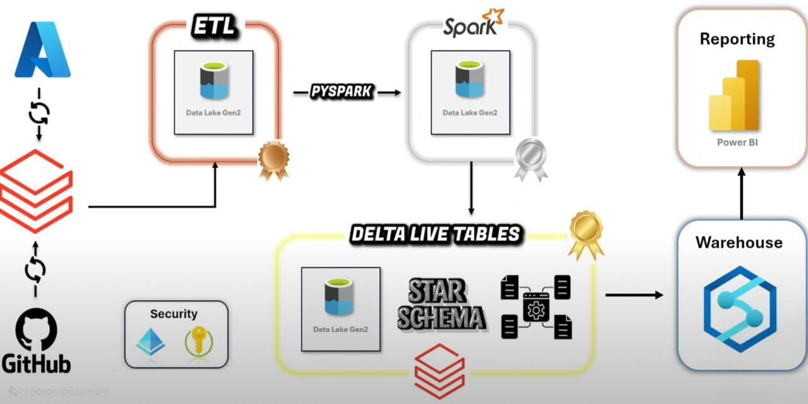

# 🏗️ Sales Data Engineering Project – Medallion Architecture (Azure + Databricks)

This project demonstrates a complete data engineering pipeline using the **medallion architecture** (bronze, silver, gold layers) built with **Databricks**, **Azure Data Lake Gen2**, and **Unity Catalog**.

---

## 📌 Project Overview

- **Use Case**: Sales analysis across customers, products, orders, and regions
- **Tools Used**:
  - Databricks with Unity Catalog
  - Azure Data Lake Storage Gen2
  - Power BI (for final reporting)

---

## 🧱 Architecture

- **Bronze Layer**: Raw data ingestion using Databricks Auto Loader from Azure Data Lake Gen2.
- **Silver Layer**: Cleaned and transformed data using SQL, window functions, joins, and aggregations
- **Gold Layer**:
  - **Customers**: SCD Type 1 (upserts)
  - **Products**: SCD Type 2 (history tracking)
  - **Orders**: Star schema combining `customers`, `products`, `regions`

---

## 📂 Datasets Used

- `customers.parquet`
- `products.parquet`
- `orders.parquet`
- `regions.parquet`

---

## 🔁 ETL Flow

1. Ingest data into **Bronze** from ADLS Gen2
2. Clean and enrich data in **Silver**
3. Apply SCD1, SCD2, and star schema modeling in **Gold**
4. Save gold outputs back to **Azure Data Lake**
5. Connect to **Power BI** for visualization

---

## 🛠️ Technologies

| Component     | Tool                          |
|---------------|-------------------------------|
| Data Platform | Azure Data Lake Gen2          |
| Processing    | Databricks (PySpark & SQL)    |
| Governance    | Unity Catalog (3-level: catalog.schema.table) |
| Orchestration | Notebooks + Pipelines         |
| Reporting     | Power BI                      |

---

## 📊 Visuals

You can include:
- Architecture diagrams
- Power BI dashboard screenshots
- Data lineage view from Unity Catalog (optional)

---

## 🚀 How to Run This Project

1. Upload raw data to your ADLS container under `/source/`
2. Run the notebooks in order:
   - Bronze ingestion
   - Silver transformation
   - Gold layer modeling
3. Connect your Power BI using a Delta table connector or `.odc` file

---

## 📁 Folder Descriptions

| Folder          | Contents                                  |
|------------------|--------------------------------------------|
| `notebooks/`     | Databricks notebooks (bronze → gold)       |
| `data_set/`      | CSVs for project                           |
| `images/`        | Optional architecture diagrams             |

## 🖼️ Project Architecture

## 🙌 Author

**Bhagavath Darapureddy**  
Data Engineering enthusiast | George Washington University  

